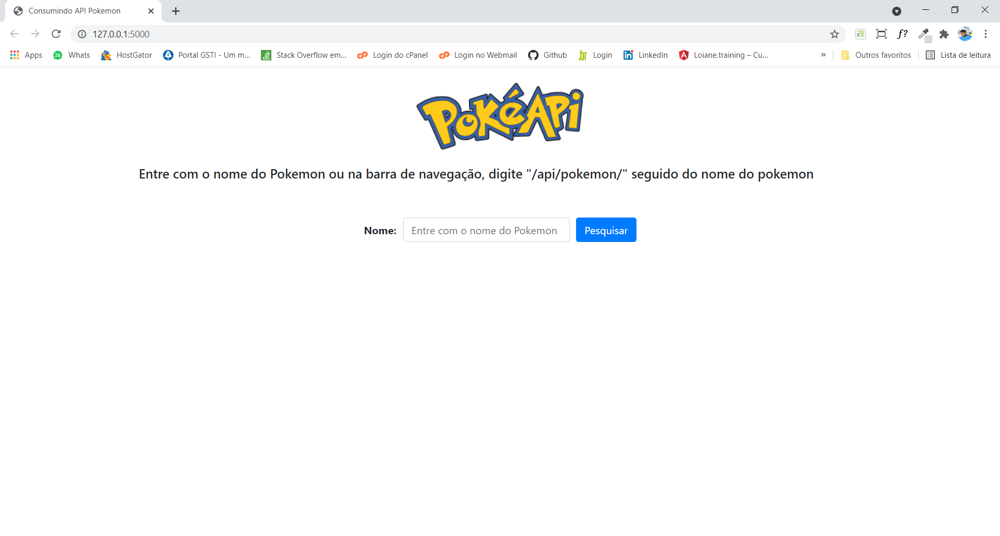
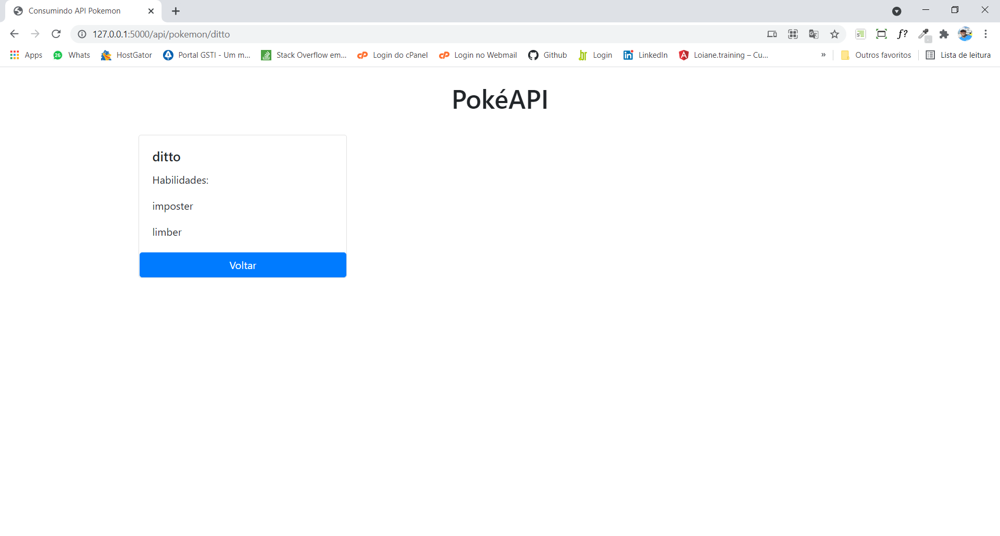

<br/>

<div align="center">
	
    <br/>
</div>
<br/>
- Telas:
<br/>
<div align="center">
	
</div>    
<br/>
<div align="center">
        
</div>

<br/>

## 📥 Instalação e execução

Faça um clone desse repositório e acesse o diretório:

```bash
$ git clone https://github.com/antoniocsimoes/ZRPTeste.git && cd ZRPTeste
```

Criei o ambiente virtual:

```bash
python -m venv env
```

Instale os pacotes:

```bash
pip install -r requirements.txt
```

Execute o comando:

```bash
python run.py
```
